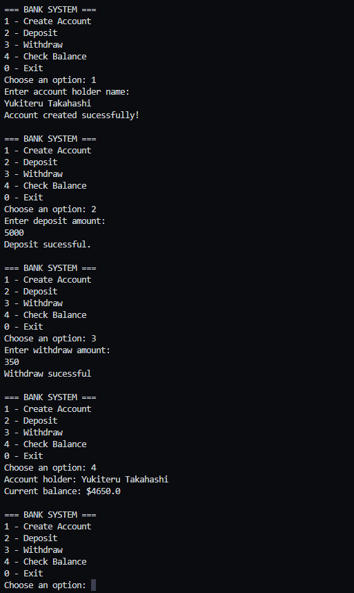

## 📸 Demonstração

## Bank System (Java Console) 🏦
Um sistema bancário robusto desenvolvido em Java, operando inteiramente via console. Este projeto simula o funcionamento interno de um banco, permitindo a gestão de uma conta bancária com validações de saldo e segurança de dados.

## 🚀 Funcionalidades
O sistema oferece um menu interativo com as seguintes opções:

Create Account: Registra um novo titular e inicializa uma conta.

Deposit: Permite adicionar fundos à conta (com validação de valores positivos).

Withdraw: Realiza saques, verificando se há saldo suficiente disponível.

Check Balance: Exibe o nome do titular e o saldo atual formatado.

Exit: Encerra a aplicação de forma segura.

## 🛠️ Tecnologias e Conceitos de POO
Este projeto foi construído para praticar fundamentos essenciais de desenvolvimento:

Encapsulamento: Uso de atributos private e métodos get para proteger os dados da conta.

Composição: A classe Bank possui uma instância de BankAccount, simulando uma relação real de entidade.

Lógica de Fluxo: Implementação de switch-case e loops while para manter a aplicação rodando.

Entrada de Dados: Uso da classe Scanner para interação em tempo real com o usuário.

## 📋 Como Executar

Pré-requisitos
Java JDK 11 ou superior instalado.

Passo a Passo
1. Clone o repositório:

Bash
git clone https://github.com/seu-usuario/bank-system-java.git

2. Compile os arquivos .java:
javac Bank.java BankAccount.java Main.java

3. Execute o programa:

java Main

📂 Estrutura do Código

Main.java: Ponto de entrada, gerencia a interface do usuário e o menu.

Bank.java: Gerencia a existência da conta no sistema.

BankAccount.java: Contém a lógica de negócio (saques, depósitos e saldo).
